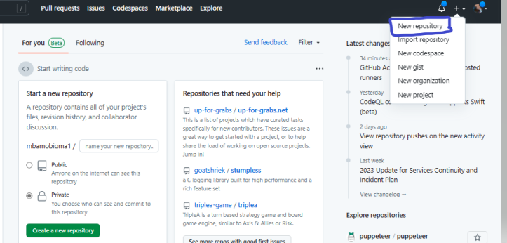
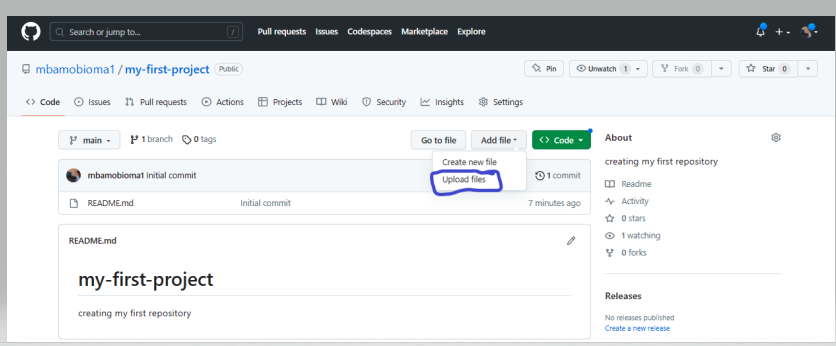

# How to Host Project on GitHub Pages Free and Make Changes on Already Hosted Project

You've developed an awesome project, oh yeah! that's great, but don't you think putting your project out there for feedback makes a lot of sense?

Let's get it straight, you are working on a client project and you are done with the project. Your client needs to see what the project looks like and will probably ask for some changes or have you add new features to the project. How do you show your distanced client the project and have him/her access it? How do you make changes or add new features, without deleting and rehosting the project each time you make changes or add new features to the project? No worries, this step-by-step tutorial will put you through with much ease.

In this tutorial, we covered the following:
* How to create GitHub account.
* How to create a repository.
* How to upload project to a repository.
* How to host project using GitHub Pages.
* How to make changes on already hosted project.
## Steps to Host Project on GitHub Pages
Take the following steps to host your project and make changes or add new features if there is need to do so:
1. Create GitHub account.
2. Create repository.
3. Upload your project to the repository
4. Host your project.
5. Make changes on already hosted project.
### 1. Create GitHub Account
With a personal accont on [GitHub.com](https://github.com/) you can:
* Create a repository
* host projects
* collaborate with others
* Connect with the GitHub community etc.

To sign up for a GitHub account navigate to [https://github.com/](https://github.com/) and follow the prompts.
### 2. Create a Repository
With a [repository](https://docs.github.com/en/repositories/creating-and-managing-repositories/about-repositories) you can do the following:
* Upload your code project
* save projects for reference purposes
* host your projects on GitHub Pages etc.
#### Steps on How to Create Repository
1. click the plus icon on any of the GitHub pages
2. click on **New repository**

3. name your repository eg ***my-first-project***
4. set it public (make sure it is public if you plan on hosting your project else it won't work)
5. add a description of the repository (optional)
6. check **Add a READ me file**
7. click on **Create repository**

### 3. Upload Your Project to the repository
On the repository you created at step one do the following:

1. click on **Add file**
2. click on **upload files**

3. drag and drop your project files
(Note: ensure what you upload is a file or files, not a folder, your HTML file name should has index.html else your hosting won't work.)
4. After uploading your files click on **commit changes**

### 4. Host Your Project
After uploading your projects to the repository

1. click on settings
2. click on **Pages** on your left
3. change the **Branch to main** (by default it is set as none)
4. click on **save**

5. wait a bit, and refresh to get a link for visiting your live project
6. copy the URL link and share it with whoever you want to see your project now that it has been hosted.

### 5. Make Changes or Add New Features to Already hosted project
To make changes to your hosted project now you have gotten some corrections without deleting and rehosting:

1. make changes to your local file
2. click on **Add file** (on the same repository you hosted).
3. click on **Upload file**
4. drag and drop your project file or files
5. click on commit changes
6. visit your hosted project, and refresh to see the changes you made on the hosted project.

### Conclusion
You can have your project hosted and make changes even after hosting without deleting and rehosting the project. Am sure this tutorial is helpful why not follow me on [Twitter](https://twitter.com/FidelisObioma) for daily tips on web development?
